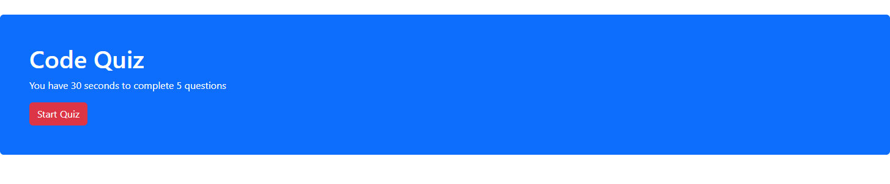

# Code Quiz
​
## Table of contents
​
- [Overview](#overview)
  - [The challenge](#the-challenge)
  - [User Story](#user-story)
  - [Acceptance Criteria](#acceptance-criteria)
  - [Screenshot](#screenshot)
  - [Links](#links)
- [My process](#my-process)
  - [Built with](#built-with)
  - [What I learned](#what-i-learned)
  - [Continued development](#continued-development)
  - [Useful resources](#useful-resources)
- [Author](#author)
​
## Overview
​
### The challenge
​
Create a timed quiz on fundamentals of HTML, CSS and Javascript 
​
### User Story
​
```
AS A coding boot camp student
I WANT to take a timed quiz on JavaScript fundamentals that stores high scores
SO THAT I can gauge my progress compared to my peers
```
​
### Acceptance Criteria
​
```
GIVEN I am taking a code quiz
WHEN I click the start button
THEN a timer starts and I am presented with a question
WHEN I answer a question
THEN I am presented with another question
WHEN I answer a question incorrectly
THEN time is subtracted from the clock
WHEN all questions are answered or the timer reaches 0
THEN the game is over
WHEN the game is over
THEN I can save my initials and score
```
### Screenshot
​

.png)
.png)
.png)

### Links
​
- Live Site URL: [Code Quiz](https://ocampoad.github.io/Code-quiz/)
​
## My process
​
### Built with
​
- Bootstrap
- Javascript
- Jquery
​
### What I learned
​
I learned more how to be more interactive using Javascript. I learned how to use Jquery and Bootstrap. With the help of the documentation, I was able to implement styles using different classes. In addition, I also learned how to target html elements, class, and css attributes using Jquery. I also learned how to store data in local storage on the browser. 
​
### Continued development
​
I would like to learn more about local storage and how to save several occurence, not just the previous event. I have difficulty saving objects in local storage. I also enjoyed using bootstrap, so I would like to continue using it in the future. 
​
### Useful resources
- [Bootstrap](https://getbootstrap.com/) - I was able to use different layouts and components using bootstrap. 
- [Jquery](https://jquery.com/) - I was able to learn how to use jquery using their documentation
- [W3schools](https://www.w3schools.com/js/default.asp) - Their easy to use website was helpful showing examples for each new chapters
- [Stackoverflow](https://stackoverflow.com/) - Helpful for more specific question regarding a technique I could not find at other websites
​
## Author
​
- Website - [Adriane Ocampo](https://ocampoad.github.io/Adriane_Ocampo_Portfolio/)
​